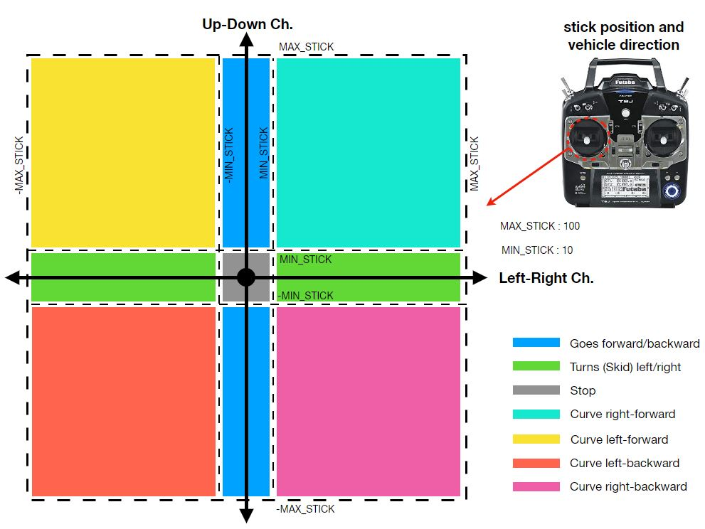

# Brushless Drive Wheels with MBED NUCLEO-F767ZI

This project is an extended version of [this repo](https://github.com/rasheeddo/BrushlessDriveWheels) for mbed os5.
The wheels is controled by sending command data to the ESC and listen to it. In the code there is a SBUS parser which developed by Mark Fesslar. The receiver SBUS port is connected with mbed serial port. SBUS-RX is using interrupt to read incoming data and run on a thread. And the UGV driver code runs on the other thread. The transmitter value from user uses semaphores to protect the data between threads.

Here is the stick position and vehicle direction

